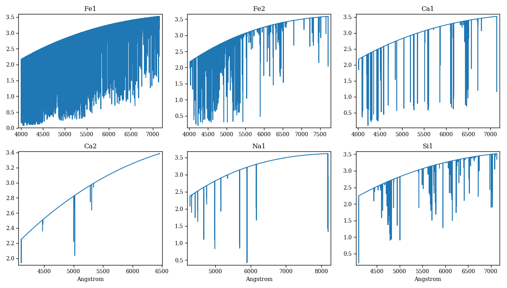
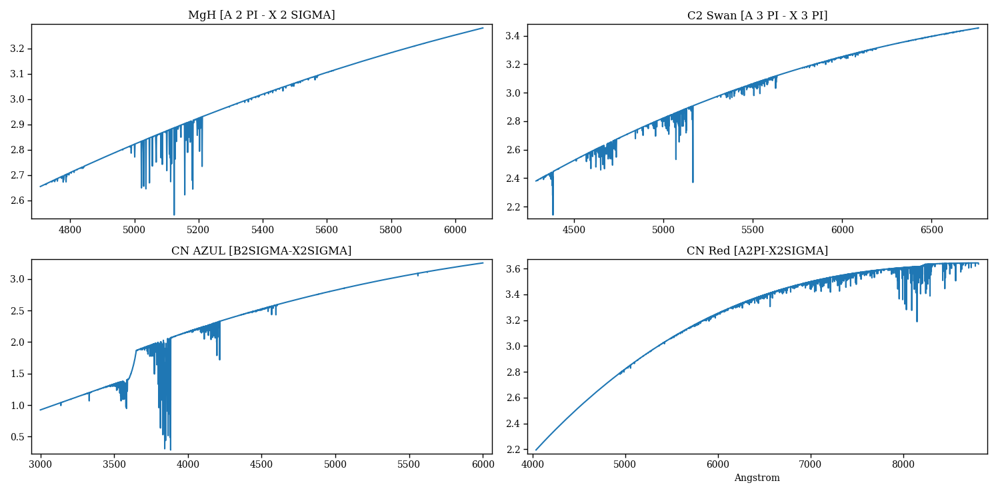
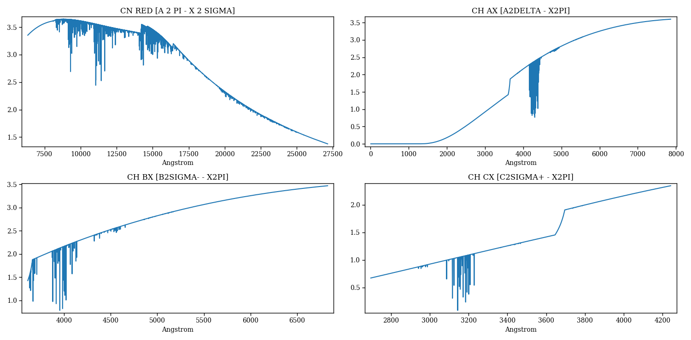

Spectral synthesis
==================

This section describes the Python interface for the `PFANT Spectral Synthesis
Software <http://trevisanj.github.io/PFANT>`__ for Astronomy.

Spectral synthesis softwares have a fundamental role in Astronomy.
It is a crucial step in determining stellar properties
- such as temperature, metallicity, and chemical abundances -
in which the synthetic spectrum (or a combination of several of these) is compared with the
measured spectrum of a star or a whole stellar population either by the full spectrum fitting,
spectral energy distribution or specific spectral lines and regions.
It is of great interest that the software has a comprehensive and intuitive user interface and
easiness of parameter input and its multiple variations, and also tools for incorporating data
like atomic/molecular lines, atmospheric models, etc.

Package ``f311.pyfant`` provides a Python interface to the PFANT Fortran binaries, including the
ability to run the Fortran binaries in parallel *via* GUI or API.

Applications
------------

The applications related to package f311.pyfant are listed below. For them to work, you need to
have `PFANT <http://trevisanj.github.io/PFANT/install.html>`_ installed.

The `PFANT Quick Start <http://trevisanj.github.io/PFANT/quick.html>`_ serves as a guide to
using some of these applications.

Graphical applications
~~~~~~~~~~~~~~~~~~~~~~

- ``x.py`` -- PFANT Launcher -- Graphical Interface for Spectral Synthesis

Command-line tools
~~~~~~~~~~~~~~~~~~

- ``copy-star.py`` -- Copies stellar data files (such as main.dat, abonds.dat, dissoc.dat) to local directory
- ``link.py`` -- Creates symbolic links to PFANT data files as an alternative to copying these (sometimes large) files into local directory
- ``run4.py`` -- Runs the four Fortran binaries in sequence: ``innewmarcs``, ``hydro2``, ``pfant``, ``nulbad``
- ``save-pdf.py`` -- Looks for files "*.norm" inside directories session-* and saves one figure per page in a PDF file

Coding using the API
--------------------

This section contains a series of examples on how to use the PFANT Fortran executables from a
Python script. These "bindings" to the Fortran binaries, together with the ability to load,
manipulate and save PFANT data files using ``f311.filetypes``, allow for complex batch operations.

.. todo:: Figure numbers because Latex does not place figures immediately after the code.

Spectral synthesis
~~~~~~~~~~~~~~~~~~

.. literalinclude:: ../examples/synthesis/synthesis-simple.py

.. figure:: figures/norm-convolved.png
   :align: center

Spectral synthesis - convolutions
~~~~~~~~~~~~~~~~~~~~~~~~~~~~~~~~~

The following example convolves the synthetic spectrum (file "flux.norm") with Gaussian profiles of
different FWHMs.

.. literalinclude:: ../examples/synthesis/synthesis-many-convolutions.py

.. figure:: figures/many-convs.png
   :align: center

Spectral synthesis - Continuum
~~~~~~~~~~~~~~~~~~~~~~~~~~~~~~

.. literalinclude:: ../examples/synthesis/synthesis-continuum.py

.. figure:: figures/continuum.png
   :align: center

Spectral synthesis - Separate atomic species
~~~~~~~~~~~~~~~~~~~~~~~~~~~~~~~~~~~~~~~~~~~~

PFANT atomic lines files contains wavelength, log_gf and other tabulated information for several
(element, ionization level) atomic species.

The following code calculates isolated atomic spectra for a list of arbitrarily chosen atomic species.

.. literalinclude:: ../examples/synthesis/synthesis-atoms.py

Spectral synthesis - Separate molecules
~~~~~~~~~~~~~~~~~~~~~~~~~~~~~~~~~~~~~

.. literalinclude:: ../examples/synthesis/synthesis-molecules.py

etc.

Gaussian profiles as nulbad outputs
~~~~~~~~~~~~~~~~~~~~~~~~~~~~~~~~~~~

``nulbad`` is one of the Fortran executables of the PFANT package. It is the one that convolves
the synthetic spectrum calculated by ``pfant`` with a Gaussian profile specified by a "fwhm" parameter.

.. literalinclude:: ../examples/synthesis/gaussian-profiles.py

.. figure:: figures/gaussian-profiles.png
   :align: center

Plot hydrogen profiles
~~~~~~~~~~~~~~~~~~~~~~

.. literalinclude:: ../examples/plot-hydrogen-profiles/plot-hydrogen-profiles.py

.. figure:: figures/hydrogen-profiles.png
   :align: center

